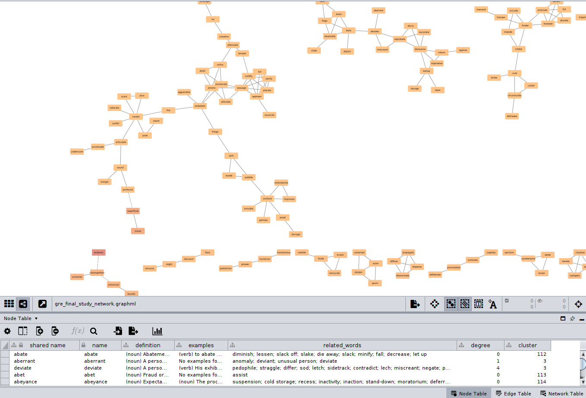

# Vocabulary Network Generator 

This project contains a Python script (`network.py`) that takes a list of vocabulary words and transforms them into a rich, interactive network graph. This graph is designed to be a powerful study tool, helping you visualize the relationships between words for better memorization.

The script fetches definitions, example sentences, and semantically related words, then clusters them into logical groups. The final output is a `.graphml` file that can be explored in network analysis software like Cytoscape or Gephi.



---
## What it Does

- **Data Enrichment**: For each word in your list, it fetches high-quality definitions and example sentences from an online dictionary API.
- **Relationship Mapping**: It uses the NLTK WordNet database to find a broad range of **similar words** (synonyms, hypernyms, hyponyms) and **antonyms**.
- **Intelligent Clustering**: It uses the efficient **Leiden algorithm** to analyze the "similar word" connections and group your vocabulary into semantic clusters.
- **Efficient Caching**: The first time you run the script, it saves all the fetched data into a local cache file (`api_cache.json`). Subsequent runs are almost instant as they read from this cache, avoiding slow API calls.
- **Export for Visualization**: It saves the final, data-rich network into a `gre_final_study_network.graphml` file, ready for visualization.

---
## File Descriptions

- `network.py`: The main Python script that runs the entire process.
- `words.txt`: **(You must create this file)** The input file where you list your vocabulary, one word per line.
- `api_cache.json`: An automatically generated file that stores the data fetched from online APIs to speed up future runs. You can safely delete this file to force a refresh of the data.
- `gre_final_study_network.graphml`: The final output file. This is the network graph that you will open in Cytoscape.

---
## Setup

Before running the script, you need to install the necessary Python libraries and create your word list.

### 1. Install Dependencies
Make sure you have Python 3 installed. Then, run the following command in your terminal to install all required packages:
```bash
pip install nltk networkx igraph leidenalg tqdm requests
```

### 2. Download NLTK Data
The script also requires data from the NLTK library. Run this command in your terminal to start a Python interpreter and download it:
```python
import nltk
nltk.download('wordnet')
nltk.download('omw-1.4')
```
You only need to do this once.

---
## How to Run

### 1. Create `words.txt`
Create a file named `words.txt` in the same directory as the script. Add your vocabulary words to this file, with **one word on each line**.

Example `words.txt`:
```
mitigate
bolster
enervate
laconic
advocate
pedestrian
garrulous
```

### 2. Execute the Script
Run the script from your terminal:
```bash
python network.py
```

- **First Run**: The script will be slow as it fetches data for each word and builds the `api_cache.json` file. Be patient and let it complete.
- **Subsequent Runs**: It will be very fast, loading directly from the cache.

### 3. To Refresh Data
If you add more words to `words.txt` or want to fetch fresh data, simply **delete the `api_cache.json` file** and run the script again.

---
## Visualizing the Output in Cytoscape 🎨

The best way to explore your network is with a tool like [Cytoscape](https://cytoscape.org/).

1.  **Import Network**: Open Cytoscape, go to `File` > `Import` > `Network from File...`, and select your `gre_final_study_network.graphml` file.
2.  **Apply a Layout**: Go to the `Layout` menu and choose an algorithm like `Prefuse Force Directed Layout`. This will organize the nodes visually.
3.  **Style the Graph**: Use the **Style** panel to map your data to visual properties.
    - **Node Color → Cluster**:
        - **Property**: `Node` > `Fill Color`
        - **Column**: `cluster`
        - **Mapping Type**: `Discrete Mapping` (This colors each semantic group differently).
    - **Node Size → Degree**:
        - **Property**: `Node` > `Size`
        - **Column**: `degree`
        - **Mapping Type**: `Continuous Mapping` (This makes more connected "hub" words larger).
    - **Edge Color → relation**:
        - **Property**: `Edge` > `Stroke Color`
        - **Column**: `color`
        - **Mapping Type**: `Passthrough Mapping` (This makes "similar" edges blue and "antonym" edges red).
4.  **Explore Data**: Click on any node (word) and look at the **Node Table** at the bottom of the screen to see its definition, example sentences, and related words.